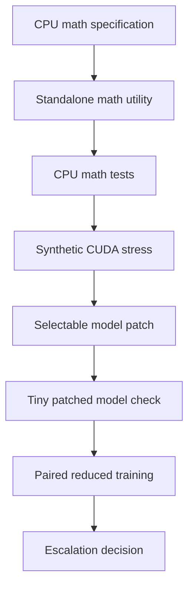

# Symmetric Bipolar Attention Validation Design

## Status

Approved design specification for a bounded validation program. This document is documentation-only and does not implement Symmetric Bipolar Attention, edit Python code, run tests, or run GPU workloads.

## Objective

Validate the Symmetric Bipolar Attention idea as a staged research intervention for CASCADES without treating it as an immediate replacement for the current attention path or continual-PEFT architecture.

The program should answer four questions in order:

1. Is the proposed sinh-cosh attention formula mathematically equivalent to its reference decomposition under finite-precision CPU tests?
2. Is the signed attention operator numerically safe under masks, extreme logits, mixed signs, and gradient flow?
3. Can the operator survive synthetic CUDA stress and tiny patched-model forward/backward checks within the 8 GB GPU convention and 7500 MB VRAM threshold?
4. If it survives the earlier gates, does a reduced paired continual-training run show finite metrics and useful retention evidence under the same manifest, seed, and artifact discipline used by existing CASCADES experiment cycles?

The desired outcome is a durable evidence ladder that can validate, falsify, or bound the idea before any large-suite escalation.

## Non-goals

- Do not replace the CASCADES model architecture by default.
- Do not patch every model call site or make Symmetric Bipolar Attention the default attention implementation.
- Do not launch full current4, v10, Digital Twin, broad settings fuzzer, or larger-suite experiments until all earlier gates pass.
- Do not claim catastrophic forgetting is solved from CPU math, synthetic CUDA, tiny model, or single reduced-suite evidence.
- Do not weaken existing finite-loss, manifest, seed, artifact, or 7500 MB VRAM guardrails.
- Do not conflate a mathematically interesting signed operator with an approved production training change.

## Background and repository fit

CASCADES is currently a continual-PEFT research codebase with artifact-driven experiment cycles. Existing project conventions imply the following placement if this design is later implemented:

- Standalone mathematical utilities should live near [`cascades/math_ops.py`](cascades/math_ops.py:1).
- CPU math tests should live near [`tests/test_math.py`](tests/test_math.py:1).
- Selectable model patching should occur after the model is loaded at [`AutoModelForCausalLM.from_pretrained()`](train.py:269), not by changing the default training contract.
- Direct paired experiment runners should be modeled on the artifact shape and arm discipline of [`run_arm()`](experiments/cf_cycle_1/run_nullspace_ablation.py:431).
- GPU work should preserve the 8 GB hardware convention and fail under the 7500 MB VRAM threshold.

The validation program is deliberately separated from immediate architecture integration because prior CASCADES cycles show that plausible mechanisms can activate correctly while still failing promotion thresholds. Symmetric Bipolar Attention should therefore earn escalation through gates rather than being merged directly into the main training path.

## Mathematical definition

Let query-key logits be `Z = QK^T / sqrt(d)` and let `V_mask` be the Boolean set of valid key positions for each attention row. Masking must be applied as a validity set, not by negating an additive negative-infinity mask, because `-(-inf)` would turn masked positions into dominant positive evidence in the negative channel.

The validation target is the row-wise sinh-cosh normalized signed attention:

```text
A_sba[i] = sinh(Z[i]) / sum_j_in_V_mask cosh(Z[j])  if i is valid
A_sba[i] = 0                                               if i is masked
```

For stable implementation and equivalence testing, this should be represented by positive and negative exponential evidence channels over valid positions only:

```text
E_pos[i] = exp(Z[i])   if i is valid else 0
E_neg[i] = exp(-Z[i])  if i is valid else 0
D = sum_j E_pos[j] + E_neg[j]
A_sba[i] = (E_pos[i] - E_neg[i]) / D  if D > 0 else 0
```

The formula is equivalent to the sinh-cosh expression because `sinh(x) = (exp(x) - exp(-x)) / 2` and `cosh(x) = (exp(x) + exp(-x)) / 2`, so the factors of two cancel. It can also be viewed as a signed difference of positive channels sharing one denominator:

```text
A_sba = E_pos / D - E_neg / D
```

The implementation handoff must still provide one readable reference function and one optimized function, then prove equivalence between them over CPU tests before using either in CUDA or model patching. If a later researcher proposes a different SBA variant, it must receive a new formula identifier and restart Gate 1 rather than reusing this specification's pass/fail artifacts.

Required mathematical invariants:

1. **Exact formula equivalence:** the reference sinh-cosh decomposition and optimized implementation agree within stated tolerances across representative shapes, dtypes, masks, and sign patterns.
2. **Safe masking:** masked positions contribute exactly zero effective attention weight and are inert in the value aggregation.
3. **Signed L1 bound:** each attention row has bounded signed magnitude. The default gate requires `sum(abs(A_sba[row])) <= 1 + tolerance`, which follows from `abs(E_pos - E_neg) <= E_pos + E_neg` over the shared positive denominator.
4. **Finite outputs and gradients:** attention weights, value outputs, and backward gradients are finite under normal and stress inputs.
5. **Jacobian claim validation or falsification:** any claim that SBA improves, bounds, balances, or preserves Jacobian behavior must be directly measured. If the measured Jacobian does not support the claim, the artifact must record falsification rather than reinterpret the claim after the fact.

## Architecture and components



### Component 1: standalone math utility

Purpose: expose pure functions for the SBA reference formula, optimized formula, signed normalization checks, masking behavior, and optional diagnostic Jacobian probes.

Implementation notes for the later code worker:

- Keep the utility independent from trainer state, PEFT adapter state, and model patching.
- Accept explicit tensors for logits, masks, values, and optional scales.
- Return both the signed attention weights and value aggregation where useful.
- Provide diagnostics for row signed sum, row absolute sum, finite masks, and maximum masked leakage.

### Component 2: CPU math tests

Purpose: make the formula falsifiable before GPU work.

Coverage should include:

- small exact tensors with hand-checkable expected values;
- random logits over multiple shapes;
- all-valid, partially masked, and nearly all-masked rows;
- positive-only, negative-only, symmetric, and extreme logits;
- float32 baseline and any supported lower-precision behavior only after float32 passes;
- signed L1 bound checks;
- finite output and gradient checks;
- Jacobian diagnostic checks tied to the claim being tested.

### Component 3: synthetic CUDA stress and benchmark scripts

Purpose: test CUDA numerical behavior without invoking model loading or training.

Scripts should be separate experiment artifacts rather than production code paths. They should record:

- device name and CUDA availability;
- tensor shapes and dtypes;
- mask density;
- random seed;
- forward finite status;
- backward finite status;
- peak VRAM;
- wall-clock timing for baseline attention and SBA attention;
- signed L1 maximum;
- maximum masked leakage;
- artifact JSON path and log path.

This stage is allowed to use CUDA only after CPU math gates pass and explicit user approval is granted for GPU work. It must stop if peak VRAM exceeds 7500 MB.

### Component 4: selectable model patching

Purpose: patch a loaded causal language model in a selectable, reversible way only after model load.

Expected implementation shape:

- Load the model through the existing training path at [`AutoModelForCausalLM.from_pretrained()`](train.py:269).
- Apply an opt-in patch flag after load, for example through a dedicated patch helper and a config or CLI option.
- Patch the smallest viable attention module surface for the target architecture.
- Preserve a no-patch baseline path.
- Emit an artifact proving which modules were patched and which remained unchanged.

The patch must be off by default. A failed patch or unsupported architecture should abort the SBA arm rather than silently falling back to baseline while labeling the run as SBA.

### Component 5: tiny patched-model forward/backward

Purpose: prove the patched model can run a minimal forward/backward pass before any training experiment.

Required evidence:

- model ID;
- patched module count;
- input shape;
- finite loss;
- finite gradients for patched parameters or attention path tensors;
- peak VRAM under 7500 MB;
- no silent baseline fallback;
- JSON artifact and log artifact.

### Component 6: paired reduced training runner

Purpose: compare baseline and SBA-patched arms under the same reduced manifest, seed, and training envelope.

The direct paired runner should follow the existing artifact discipline of [`run_arm()`](experiments/cf_cycle_1/run_nullspace_ablation.py:431): separate control and treatment directories, durable configs, task manifests, metrics, run status, logs, GPU snapshots where available, and a final comparison artifact only after both arms pass their gates.

The first training envelope should be reduced and bounded:

- same manifest for control and SBA treatment;
- same seed;
- same model ID;
- same rank, max length, epochs, and batch behavior;
- same hardware and 7500 MB VRAM threshold;
- finite metrics required for both arms;
- no larger-suite escalation unless all gates pass.

## Evidence ladder

Each stage blocks the next stage unless it passes.

### Gate 1: CPU formula equivalence and invariants

Inputs: standalone math utility and CPU test suite.

Must pass:

- reference and optimized formulas match within documented tolerances;
- masking is safe with no masked leakage above tolerance;
- signed L1 bound holds;
- outputs and gradients are finite;
- Jacobian diagnostic either supports the stated claim or records falsification;
- tests are deterministic under fixed seeds.

Failure action: stop. Revise the formula or abandon the variant. Do not run CUDA.

### Gate 2: synthetic CUDA stability

Inputs: standalone CUDA stress scripts and CPU-passing formula.

Must pass:

- finite forward outputs;
- finite backward gradients;
- no masked leakage above tolerance;
- signed L1 bound preserved within CUDA tolerance;
- peak VRAM under 7500 MB;
- benchmark artifacts persisted.

Failure action: stop. Treat as numerical or memory falsification until repaired.

### Gate 3: tiny patched-model forward/backward

Inputs: selectable model patch and tiny batch.

Must pass:

- patch is actually installed on intended attention modules;
- forward loss is finite;
- backward gradients are finite;
- peak VRAM under 7500 MB;
- artifact proves no silent fallback.

Failure action: stop. Do not launch training.

### Gate 4: paired reduced training

Inputs: direct paired runner with baseline and SBA arms.

Must pass:

- same manifest and seed across arms;
- both arms complete;
- both arms have finite metrics;
- both arms remain under 7500 MB peak VRAM;
- treatment artifact proves SBA patch active;
- comparison artifact is written only after both arm gates pass.

Failure action: do not escalate. Route to result criticism with evidence and likely failure mode.

### Gate 5: larger-suite escalation decision

Inputs: valid Gate 4 comparison plus result critic review.

Escalation may be considered only if:

- all prior gates passed;
- treatment shows useful retention or stability evidence without unacceptable average-accuracy regression;
- artifact quality is sufficient for a critic to reproduce the decision boundary;
- the user explicitly approves the larger run.

Failure action: revise, narrow, or abandon SBA. Do not promote by default.

## Pass and fail criteria summary

| Area | Pass criterion | Fail criterion |
| --- | --- | --- |
| Formula | Reference and optimized outputs match within tolerance | mismatch, undefined normalization, or post-hoc formula drift |
| Masking | masked positions are inert within tolerance | masked leakage, NaNs from all-masked rows, or sign leakage through mask |
| Bound | signed L1 row bound is satisfied | unbounded row magnitude or undocumented bound change |
| Finite math | CPU outputs and gradients finite | NaN or Inf in output or gradient |
| Jacobian | claim is measured and accepted or explicitly falsified | unmeasured Jacobian claim or ambiguous interpretation |
| CUDA | synthetic forward/backward finite under 7500 MB | non-finite CUDA values or VRAM above 7500 MB |
| Patch | intended modules patched with no silent fallback | unsupported model silently labels baseline as SBA |
| Tiny model | finite forward/backward under 7500 MB | non-finite loss, non-finite gradients, or memory failure |
| Training | paired same-seed reduced run with finite metrics and durable comparison | incomplete arm, mismatched manifest/seed, missing artifacts, or invalid comparison |

## Artifact plan

Recommended artifact root for the later implementation:

```text
experiments/sba_validation/
```

Recommended durable files:

```text
experiments/sba_validation/cpu_math_gate.json
experiments/sba_validation/cpu_math_gate.log
experiments/sba_validation/cuda_synthetic_gate.json
experiments/sba_validation/cuda_synthetic_gate.log
experiments/sba_validation/tiny_model_gate.json
experiments/sba_validation/tiny_model_gate.log
experiments/sba_validation/paired_reduced/control/config.json
experiments/sba_validation/paired_reduced/control/run_status.json
experiments/sba_validation/paired_reduced/control/metrics.json
experiments/sba_validation/paired_reduced/control/task_manifest.json
experiments/sba_validation/paired_reduced/control/instrumentation.json
experiments/sba_validation/paired_reduced/treatment/config.json
experiments/sba_validation/paired_reduced/treatment/run_status.json
experiments/sba_validation/paired_reduced/treatment/metrics.json
experiments/sba_validation/paired_reduced/treatment/task_manifest.json
experiments/sba_validation/paired_reduced/treatment/instrumentation.json
experiments/sba_validation/paired_reduced/comparison.json
experiments/sba_validation/RESULT_CRITIC_PACKET.md
```

Every gate artifact should include:

- git revision;
- command or entry point;
- seed;
- device information where relevant;
- exact formula variant identifier;
- mask policy;
- dtype policy;
- finite status;
- peak VRAM where relevant;
- pass/fail boolean;
- failure reasons as structured strings;
- path to raw logs.

## Risks and mitigations

### Risk: formula ambiguity

Symmetric Bipolar Attention can be described with sinh-cosh language in multiple non-equivalent ways. Ambiguity would make validation meaningless.

Mitigation: require one pinned reference formula and one optimized formula before any CUDA or model work.

### Risk: masking errors with signed weights

Signed attention can leak negative or positive mass through masked positions if masking is applied before a nonlinear transform incorrectly.

Mitigation: include explicit masked leakage tests and all-masked or nearly all-masked row behavior in Gate 1 and Gate 2.

### Risk: unstable gradients

Hyperbolic functions can amplify large logits and create overflow.

Mitigation: use stable decompositions, bounded normalization, stress tests, gradient finite gates, and early CUDA falsification.

### Risk: misleading model patch success

The model may silently use the original attention path if patching fails.

Mitigation: require patched module counts, module names, and no-silent-fallback artifacts before training.

### Risk: memory pressure on 8 GB GPU

Additional attention computations may exceed the project GPU budget.

Mitigation: enforce 7500 MB threshold at synthetic, tiny-model, and paired-training gates.

### Risk: reduced-suite overinterpretation

A reduced paired run can be useful without being a broad solution.

Mitigation: require result critic review and user approval before larger-suite escalation.

## Implementation-plan handoff notes

The next code-mode worker should implement this as a sequence of small, reviewable changes rather than a single architecture replacement.

Suggested task order:

1. Add pure SBA math utilities near [`cascades/math_ops.py`](cascades/math_ops.py:1) with an explicit reference formula, optimized formula, masking helper, signed L1 diagnostic, finite diagnostic, and optional Jacobian probe.
2. Add CPU tests near [`tests/test_math.py`](tests/test_math.py:1) covering formula equivalence, masking, signed L1 bound, finite outputs, finite gradients, and Jacobian claim validation or falsification.
3. Add a CPU gate artifact writer that records formula variant, seeds, tolerances, and pass/fail reasons without importing model code.
4. Add separate synthetic CUDA stress and benchmark scripts under a new SBA experiment directory; do not run them until CPU gates pass and the user approves GPU work.
5. Add an opt-in model patch helper invoked only after [`AutoModelForCausalLM.from_pretrained()`](train.py:269) and prove patch installation through artifacts.
6. Add a tiny patched-model forward/backward gate before any training runner.
7. Add a paired reduced runner modeled on [`run_arm()`](experiments/cf_cycle_1/run_nullspace_ablation.py:431), with baseline and SBA arms sharing manifest, seed, and run envelope.
8. Add comparison and result-critic packet generation only after both paired arms pass their individual gates.

Code-mode boundaries:

- keep SBA off by default;
- preserve existing CASCADES behavior unless an explicit SBA flag is set;
- do not remove current guardrails;
- do not run GPU workloads without explicit user approval;
- do not edit unrelated catastrophic-forgetting mechanisms while implementing the SBA validation scaffold.

## Self-review checklist

- No placeholders remain.
- The mathematical definition is explicit: valid-position sinh-cosh normalization with a shared positive denominator and zero masked weights.
- The scope is a bounded validation program, not immediate architecture replacement.
- The evidence ladder is gate-staged and blocks escalation on failure.
- Mathematical requirements include formula equivalence, safe masking, signed L1 bound, finite outputs and gradients, and Jacobian validation or falsification.
- CUDA and training work remain permission-gated and bounded by the 7500 MB VRAM threshold.
- Implementation handoff paths match the approved repository touchpoints.
- The specification does not instruct any current worker to implement code, run tests, or run GPU workloads as part of this documentation-only subtask.
