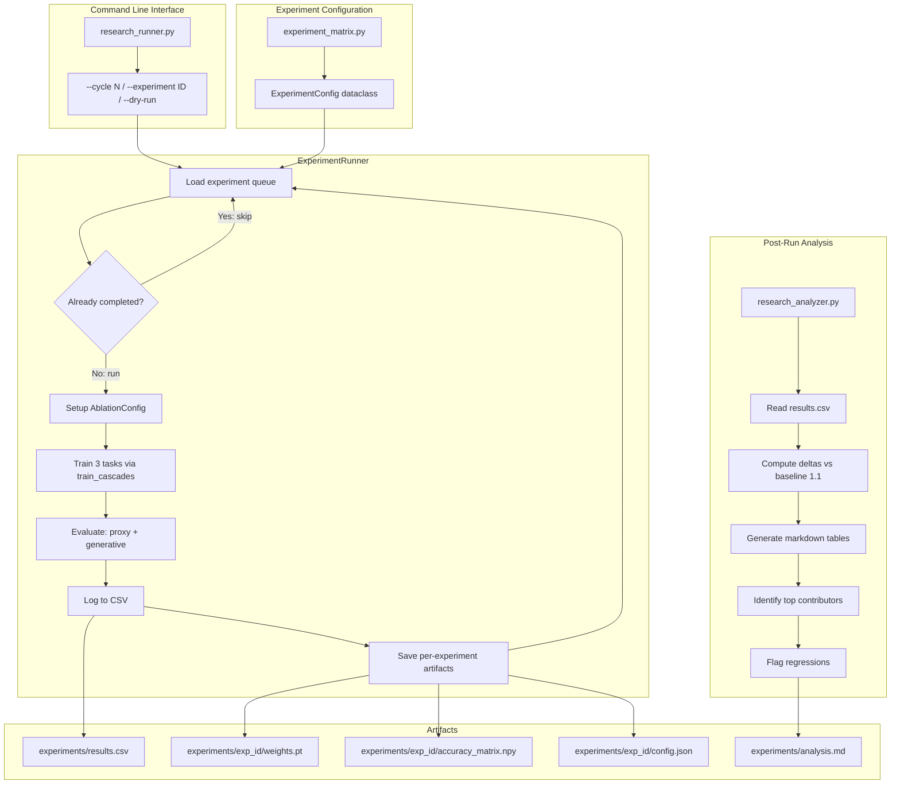
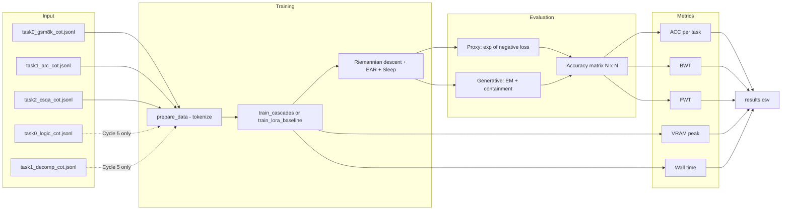

# CASCADES Research Loop Design

## 1. Executive Summary

This document specifies an **automated experiment runner** for systematically validating CASCADES v10 components, closing the proxy→generative gap, and establishing fair baselines. The runner orchestrates 18 primary experiments across 5 cycles, logging all metrics to CSV for automated analysis.

**Current state**: CASCADES v9 achieves 35.91% proxy ACC and +2.42% BWT on 3 tasks with Qwen3-4B NF4 on 5.2GB VRAM. Five v10 patches are applied but GPU-untested. Generative EM remains 0% despite ~60% containment matching.

**Goal**: Identify which components contribute most to continual learning performance, close the generative gap, and establish publication-quality ablation evidence.

---

## 2. Full Experiment Matrix

| Exp ID | Cycle       | Name                     | Config Changes vs v9 Default                                                      | Sleep | Expected Outcome                                     |
| ------ | ----------- | ------------------------ | --------------------------------------------------------------------------------- | ----- | ---------------------------------------------------- |
| 1.1    | Baselines   | Plain LoRA rank-8        | All CASCADES disabled; standard PEFT LoRA                                         | No    | Negative BWT baseline ~-5 to -15%                    |
| 1.2    | Baselines   | CASCADES v9 repro        | [`DEFAULT_CONFIG`](cascades/config.py:54) with v10 flags off                      | Yes   | ~35% ACC, ~+2% BWT — confirms reproducibility        |
| 2.1    | v10 Patches | v9 + frozen null-space   | `enable_coso_nullspace=True` + [`freeze_current_subspace()`](train.py:365) active | Yes   | BWT improvement ≥ +1% over v9                        |
| 2.2    | v10 Patches | v9 + soft-EAR            | `enable_soft_ear=True`, `ear_gamma=1e-4`                                          | Yes   | Smoother training curves, ≤ +1% ACC                  |
| 2.3    | v10 Patches | v9 + GQA preconditioning | `gqa_ratio=auto` — expect no-op on 4B with 8 KV groups                            | Yes   | Δ ACC ≈ 0% — confirms no-op hypothesis               |
| 2.4    | v10 Patches | v9 + principal expansion | `enable_principal_expansion=True`                                                 | Yes   | More stable rank revival, ≤ +1% ACC                  |
| 2.5    | v10 Patches | v9 + CFG decoding        | `cfg_lambda=1.5` — eval-time only                                                 | Yes   | Generative containment ↑, proxy ACC unchanged        |
| 2.6    | v10 Patches | Full v10 — all patches   | All v10 flags enabled                                                             | Yes   | Best overall: ≥ 37% ACC, ≥ +2% BWT                   |
| 3.1    | Ablations   | v9 minus EAR             | `enable_coso_nullspace=False`                                                     | Yes   | BWT regression — quantifies gradient redirection     |
| 3.2    | Ablations   | v9 minus Sleep           | All flags on, `enable_sleep=False`                                                | No    | ACC stable, BWT may regress — isolates consolidation |
| 3.3    | Ablations   | v9 minus PaCA            | `enable_paca=False`                                                               | Yes   | Conflict detection loss — expect ACC ↓ 2-5%          |
| 3.4    | Ablations   | v9 minus Breathing       | `enable_svc=False`                                                                | Yes   | Rank dynamics frozen — expect minor ACC ↓            |
| 3.5    | Ablations   | v9 minus DEAL            | `enable_deal=False`                                                               | Yes   | Quantization noise unfiltered — expect instability   |
| 4.1    | Generative  | Few-shot eval prompts    | Eval override: 2-shot examples in prompt                                          | Yes   | Containment ↑ to ~70%, possible EM > 0%              |
| 4.2    | Generative  | Longer generation        | Eval override: `max_new_tokens=1024`                                              | Yes   | More complete answers, containment ↑                 |
| 4.3    | Generative  | Greedy decoding          | Eval override: `do_sample=False`, `temperature=0`                                 | Yes   | Deterministic outputs, format consistency ↑          |
| 5.1    | Scaling     | 5-task run               | Add logic_cot + decomp_cot as tasks 3-4                                           | Yes   | Null-space saturation test — BWT at scale            |
| 5.2    | Scaling     | Rank sensitivity         | 3 sub-runs: rank 4, 8, 16                                                         | Yes   | Rank-performance tradeoff + VRAM impact              |

---

## 3. Architecture Diagram



---

## 4. File Structure

```
CASCADES--continual-PEFT-for-Local-LLMs/
├── research_runner.py          # Main experiment orchestrator
├── research_analyzer.py        # Post-run analysis and comparison
├── experiment_matrix.py        # All 18 experiment definitions
├── lora_baseline.py            # Fair LoRA baseline implementation
├── experiments/                # Created at runtime
│   ├── results.csv             # Master results log
│   ├── analysis.md             # Generated comparison tables
│   ├── exp_1.1/                # Per-experiment artifacts
│   │   ├── config.json
│   │   ├── accuracy_matrix.npy
│   │   ├── weights.pt
│   │   ├── training.log
│   │   └── generative_samples.json
│   ├── exp_1.2/
│   │   └── ...
│   └── ...
├── cascades/                   # Existing library — unchanged
│   ├── config.py               # AblationConfig dataclass
│   ├── adapters.py             # CASCADESAdapter, CASCADESLinear
│   ├── data.py                 # prepare_data, TASK_FILES
│   ├── eval.py                 # Generative evaluation
│   ├── injection.py            # inject_cascades, D-MoLE
│   ├── math_ops.py             # Riemannian ops, soft-EAR
│   └── sleep.py                # SleepConsolidation
├── train.py                    # Existing training orchestrator
├── evaluate.py                 # Existing EM diagnostic
└── data/                       # Existing training data
    ├── task0_gsm8k_cot.jsonl
    ├── task0_logic_cot.jsonl   # Available for 5-task scaling
    ├── task1_arc_cot.jsonl
    ├── task1_decomp_cot.jsonl  # Available for 5-task scaling
    ├── task2_action_cot.jsonl
    └── task2_csqa_cot.jsonl
```

---

## 5. Component Design

### 5.1 `experiment_matrix.py` — Experiment Definitions

```python
@dataclass
class ExperimentConfig:
    id: str                          # e.g. "1.1", "2.3"
    name: str                        # Human-readable name
    description: str                 # What this experiment tests
    cycle: int                       # 1-5

    # Training configuration
    use_cascades: bool = True        # False = plain LoRA baseline
    ablation_config: dict = field(default_factory=dict)  # AblationConfig overrides
    enable_sleep: bool = True
    rank: int = 8
    epochs: int = 2
    lr_liquid: float = 2e-3
    lr_gate: float = 5e-4
    lr_funlora: float = 5e-5
    seed: int = 42

    # Task configuration
    task_files: list[str] = field(default_factory=lambda: [
        "data/task0_gsm8k_cot.jsonl",
        "data/task1_arc_cot.jsonl",
        "data/task2_csqa_cot.jsonl",
    ])

    # Eval overrides
    eval_max_new_tokens: int = 512
    eval_do_sample: bool = True
    eval_temperature: float = 0.7
    eval_few_shot: int = 0           # 0 = zero-shot, 2 = few-shot
    eval_em: bool = True             # Always run generative eval

    # v10-specific flags
    enable_frozen_nullspace: bool = False
    cfg_lambda_override: float | None = None
```

The matrix is defined as a list of [`ExperimentConfig`](experiment_matrix.py:1) instances. Each experiment maps to a specific [`AblationConfig`](cascades/config.py:16) that gets passed to [`train_cascades()`](train.py:163).

### 5.2 `research_runner.py` — Experiment Orchestrator

```python
class ExperimentRunner:
    def __init__(self, output_dir: str = "experiments"):
        self.output_dir = Path(output_dir)
        self.results_csv = self.output_dir / "results.csv"
        self.completed: set[str] = self._load_completed()

    def _load_completed(self) -> set[str]:
        """Resume support: read already-completed experiment IDs from CSV."""
        if self.results_csv.exists():
            df = pd.read_csv(self.results_csv)
            return set(df["experiment_id"].values)
        return set()

    def run_experiment(self, config: ExperimentConfig) -> dict:
        """Execute a single experiment: train → eval → log."""
        # 1. Skip if already completed
        if config.id in self.completed:
            print(f"Skipping {config.id} — already completed")
            return {}

        # 2. Create experiment directory
        exp_dir = self.output_dir / f"exp_{config.id}"
        exp_dir.mkdir(parents=True, exist_ok=True)

        # 3. Save config
        save_json(config, exp_dir / "config.json")

        # 4. Reset VRAM tracking
        torch.cuda.reset_peak_memory_stats()
        wall_start = time.time()

        # 5. Build AblationConfig from overrides
        ablation = AblationConfig(**config.ablation_config)

        # 6. Run training
        if config.use_cascades:
            accuracy_matrix = train_cascades(
                config=ablation,
                enable_sleep=config.enable_sleep,
                epochs=config.epochs,
                eval_em=config.eval_em,
                output_prefix=str(exp_dir / "cascades"),
                ...
            )
        else:
            accuracy_matrix = train_lora_baseline(
                rank=config.rank,
                epochs=config.epochs,
                ...
            )

        # 7. Collect metrics
        wall_time = time.time() - wall_start
        vram_peak = torch.cuda.max_memory_allocated() / (1024**3)

        # 8. Compute CL metrics from accuracy matrix
        final_accs = accuracy_matrix[-1, :]
        avg_acc = np.mean(final_accs)
        bwt = compute_bwt(accuracy_matrix)
        fwt = compute_fwt(accuracy_matrix)

        # 9. Log to CSV
        result_row = {
            "experiment_id": config.id,
            "name": config.name,
            "cycle": config.cycle,
            "avg_accuracy": avg_acc,
            "bwt": bwt,
            "fwt": fwt,
            **{f"acc_task_{i}": final_accs[i] for i in range(len(final_accs))},
            "vram_peak_gb": vram_peak,
            "wall_time_s": wall_time,
            **config.ablation_config,
        }
        self._append_csv(result_row)

        # 10. Save artifacts
        np.save(exp_dir / "accuracy_matrix.npy", accuracy_matrix)

        return result_row

    def run_cycle(self, cycle: int):
        """Run all experiments in a specific cycle."""
        ...

    def run_all(self):
        """Run all experiments sequentially."""
        ...

    def dry_run(self):
        """Print experiment plan without executing."""
        ...
```

**Key design decisions**:

- [`train_cascades()`](train.py:163) is called directly — no subprocess spawning. This allows VRAM tracking via [`torch.cuda.max_memory_allocated()`](train.py:319) and avoids model reload overhead between experiments in the same cycle.
- Model is loaded once per cycle when possible — experiments within a cycle share the same base model, only the [`AblationConfig`](cascades/config.py:16) and adapter injection change.
- Resume works by checking [`results.csv`](experiments/results.csv) for completed experiment IDs before running.

### 5.3 `research_analyzer.py` — Post-Run Analysis

```python
class ResearchAnalyzer:
    def __init__(self, results_csv: str = "experiments/results.csv"):
        self.df = pd.read_csv(results_csv)
        self.baseline_id = "1.1"  # Plain LoRA

    def compute_deltas(self) -> pd.DataFrame:
        """Compute ACC/BWT deltas vs LoRA baseline for every experiment."""
        baseline = self.df[self.df.experiment_id == self.baseline_id].iloc[0]
        deltas = self.df.copy()
        deltas["delta_acc"] = deltas["avg_accuracy"] - baseline["avg_accuracy"]
        deltas["delta_bwt"] = deltas["bwt"] - baseline["bwt"]
        return deltas

    def component_contribution_table(self) -> str:
        """Markdown table: component → ACC contribution → BWT contribution."""
        # Compare v9 (3.x ablations) against v9 baseline (1.2)
        ...

    def v10_patch_table(self) -> str:
        """Markdown table: v10 patch → marginal improvement over v9."""
        ...

    def generative_gap_table(self) -> str:
        """Markdown table: eval strategy → EM/containment scores."""
        ...

    def flag_regressions(self) -> list[str]:
        """Return list of experiments where BWT < LoRA baseline."""
        ...

    def generate_report(self, output: str = "experiments/analysis.md"):
        """Full analysis report with all tables and recommendations."""
        ...
```

### 5.4 `lora_baseline.py` — Fair LoRA Baseline

The LoRA baseline must use **identical conditions** to CASCADES for a fair comparison:

```python
def train_lora_baseline(
    model_id: str = "p-e-w/Qwen3-4B-Instruct-2507-heretic",
    rank: int = 8,
    epochs: int = 2,
    seed: int = 42,
    eval_em: bool = True,
) -> np.ndarray:
    """Standard LoRA continual learning baseline.

    Identical to CASCADES pipeline except:
    - Uses PEFT LoraConfig instead of CASCADESAdapter
    - No Riemannian updates, no EAR, no sleep, no D-MoLE
    - Same target modules as CASCADES critical layers
    - Same optimizer (AdamW), same LR schedule, same data
    """
```

**Implementation approach**:

- Same model: Qwen3-4B NF4 via [`BitsAndBytesConfig`](train.py:210)
- Same data: [`prepare_data()`](cascades/data.py:78) with same tokenizer and JSONL files
- Same eval: both proxy `exp(-loss)` and generative via [`evaluate_generative()`](cascades/eval.py:1)
- Adapter: `peft.LoraConfig(r=8, target_modules=...)` targeting the same linear layers that [`inject_cascades()`](cascades/injection.py:1) marks as critical
- Optimizer: `AdamW` with same LR=5e-4, same gradient clipping at 1.0
- No task-boundary operations — no subspace freezing, no sleep, no D-MoLE migration
- This isolates the **CASCADES meta-architecture contribution** from the basic LoRA adaptation

---

## 6. Detailed Experiment Specifications

### Cycle 1: Baselines

#### Exp 1.1 — Plain LoRA Baseline

- **Purpose**: Establish the catastrophic forgetting floor
- **Config**: `use_cascades=False`, standard PEFT `LoraConfig(r=8, lora_alpha=16, lora_dropout=0.05)`
- **Target modules**: Same layers that D-MoLE selects as critical in CASCADES — extract from [`compute_layer_importance()`](cascades/injection.py:1) and hardcode
- **Success criteria**: Runs to completion, negative BWT confirms forgetting
- **Expected**: ACC 25-40%, BWT -5% to -15%

#### Exp 1.2 — CASCADES v9 Reproduction

- **Purpose**: Confirm v9 results are reproducible on local GPU
- **Config**: [`DEFAULT_CONFIG`](cascades/config.py:54) with v10 flags explicitly disabled: `enable_soft_ear=False`, `enable_principal_expansion=False`, `cfg_lambda=1.0`
- **Success criteria**: ACC within ±2% of 35.91%, BWT within ±1% of -1.46%
- **Expected**: ~35% ACC, ~+2% BWT

### Cycle 2: v10 Patch Validation

Each experiment adds exactly ONE v10 patch to the v9 baseline config.

#### Exp 2.1 — Frozen Null-Space

- **Purpose**: Test BWT improvement from gradient projection out of prior-task subspace
- **Config**: v9 + `enable_coso_nullspace=True` with [`freeze_current_subspace()`](train.py:365) active at task boundaries
- **Measurement**: BWT delta vs Exp 1.2
- **Risk**: If null-space basis grows too large, may constrain learning capacity. Monitor `frozen_null_basis.shape[1]` per adapter.
- **Expected**: BWT ≥ +1% improvement, ACC stable or slight ↑

#### Exp 2.2 — Soft-EAR

- **Purpose**: Test Tikhonov-regularized EAR vs hard 1% cutoff
- **Config**: v9 + `enable_soft_ear=True`, `ear_gamma=1e-4`
- **Measurement**: Training loss smoothness, final ACC delta
- **Expected**: Smoother loss curves, ≤ +1% ACC improvement

#### Exp 2.3 — GQA Preconditioning

- **Purpose**: Confirm no-op on 4B model — Qwen3-4B has 8 KV groups with 4 heads each, so `gqa_ratio = H_q/H_kv = 32/8 = 4` — but at 4B scale the K/V adapters may already be rank-constrained
- **Config**: v9 + `gqa_ratio=4.0` — auto-detected from model config
- **Measurement**: ACC delta — expecting ~0
- **Expected**: Δ ACC ≈ 0%, confirming this patch targets 8B+ models

#### Exp 2.4 — Principal Expansion

- **Purpose**: Test power-iteration-based rank expansion vs stochastic mini-batch init
- **Config**: v9 + `enable_principal_expansion=True`
- **Measurement**: Rank dynamics stability, ACC delta
- **Expected**: More stable expansion events, ≤ +1% ACC

#### Exp 2.5 — CFG Decoding

- **Purpose**: Test classifier-free guidance boost at eval time
- **Config**: v9 + `cfg_lambda=1.5` — applied only during generative evaluation
- **Measurement**: Generative containment rate delta — proxy ACC should be identical to Exp 1.2
- **Expected**: Containment ↑ 5-15%, proxy ACC unchanged

#### Exp 2.6 — Full v10

- **Purpose**: Measure cumulative effect of all 5 patches
- **Config**: All v10 flags enabled — `enable_soft_ear=True`, `enable_principal_expansion=True`, `cfg_lambda=1.5`, `gqa_ratio=auto`, `enable_coso_nullspace=True` with frozen null-space
- **Success criteria**: ACC ≥ Exp 1.2, BWT ≥ Exp 1.2
- **Expected**: ≥ 37% ACC, ≥ +2% BWT — best overall

### Cycle 3: Component Ablations

Each experiment removes exactly ONE component from the v9 full config to measure its contribution.

#### Exp 3.1 — Minus EAR

- **Config**: `enable_coso_nullspace=False`, `enable_cllora_reassign=False`
- **Measures**: Gradient redirection value
- **Expected**: BWT regression — EAR is the primary anti-forgetting mechanism

#### Exp 3.2 — Minus Sleep

- **Config**: All flags on, `enable_sleep=False` passed to [`train_cascades()`](train.py:163)
- **Measures**: Bio-inspired consolidation value
- **Expected**: ACC stable, possible BWT regression. This isolates whether [`SleepConsolidation`](cascades/sleep.py:1) contributes beyond EAR

#### Exp 3.3 — Minus PaCA

- **Config**: `enable_paca=False`
- **Measures**: Causal conflict detection value
- **Expected**: ACC ↓ 2-5% — PaCA gates information flow

#### Exp 3.4 — Minus Breathing Manifolds

- **Config**: `enable_svc=False`
- **Measures**: Autopoietic rank dynamics value
- **Expected**: Minor ACC ↓ — breathing manifolds provide adaptive capacity but are not core to anti-forgetting

#### Exp 3.5 — Minus DEAL Filter

- **Config**: `enable_deal=False`
- **Measures**: Quantization noise handling value
- **Expected**: Training instability on NF4 — DEAL filters spectral noise from 4-bit weights

### Cycle 4: Generative Gap Investigation

All experiments use v9 full config for training; only eval parameters change.

#### Exp 4.1 — Few-Shot Eval

- **Config**: `eval_few_shot=2` — inject 2 task-specific examples into the eval prompt, reusing [`build_fewshot_prompt()`](evaluate.py:66)
- **Measures**: Whether the model can produce correct answers with formatting guidance
- **Expected**: Containment ↑ to ~70%, possible EM > 0%

#### Exp 4.2 — Longer Generation

- **Config**: `eval_max_new_tokens=1024` — doubled from the default 512 used in [`evaluate_generative()`](train.py:451)
- **Measures**: Whether truncation is causing the EM gap — the model may need more tokens to complete CoT reasoning
- **Expected**: More complete answers, containment ↑

#### Exp 4.3 — Greedy Decoding

- **Config**: `eval_do_sample=False`, `eval_temperature=0.0`
- **Measures**: Whether sampling randomness causes format inconsistency
- **Expected**: More consistent output format, easier answer extraction

### Cycle 5: Scaling — Optional

#### Exp 5.1 — 5-Task Run

- **Config**: Extended task list using existing data files:
  - Task 0: `task0_gsm8k_cot.jsonl` — Math
  - Task 1: `task1_arc_cot.jsonl` — Science
  - Task 2: `task2_csqa_cot.jsonl` — Commonsense
  - Task 3: `task0_logic_cot.jsonl` — Logic
  - Task 4: `task1_decomp_cot.jsonl` — Decomposition
- **Measures**: Null-space saturation — does `frozen_null_basis` grow unbounded? Does BWT hold at 5 tasks?
- **Risk**: VRAM may exceed 8GB with 5 task boundaries worth of frozen bases. Monitor closely.
- **Expected**: BWT degrades slightly, null-space reaches ~60-80% capacity

#### Exp 5.2 — Rank Sensitivity

- **Config**: Three sub-experiments with `rank=4`, `rank=8`, `rank=16`
- **Measures**: ACC/BWT/VRAM tradeoff across ranks
- **Risk**: Rank-16 may exceed VRAM budget on 4060 Ti 8GB
- **Expected**: Rank-8 is the sweet spot; rank-4 loses expressiveness, rank-16 marginal gain at high VRAM cost

---

## 7. Metrics Collected Per Experiment

Every experiment logs the following to [`experiments/results.csv`](experiments/results.csv):

| Column                       | Type  | Description                                                     |
| ---------------------------- | ----- | --------------------------------------------------------------- |
| `experiment_id`              | str   | Unique ID: "1.1", "2.3", etc.                                   |
| `name`                       | str   | Human-readable experiment name                                  |
| `cycle`                      | int   | Cycle number 1-5                                                |
| `avg_accuracy`               | float | Mean of final row in accuracy matrix — proxy ACC                |
| `bwt`                        | float | Backward transfer: mean of `A[N,i] - A[i,i]` for `i < N`        |
| `fwt`                        | float | Forward transfer: mean of `A[i,i] - A_baseline[i]` if available |
| `acc_task_0`                 | float | Final accuracy on Task 0 — GSM8K Math                           |
| `acc_task_1`                 | float | Final accuracy on Task 1 — ARC Science                          |
| `acc_task_2`                 | float | Final accuracy on Task 2 — CommonsenseQA                        |
| `acc_task_3`                 | float | Final accuracy on Task 3 — if 5-task run                        |
| `acc_task_4`                 | float | Final accuracy on Task 4 — if 5-task run                        |
| `em_exact`                   | float | Generative exact match rate — averaged across tasks             |
| `em_normalized`              | float | Generative normalized match rate                                |
| `em_containment`             | float | Generative containment match rate                               |
| `vram_peak_gb`               | float | Peak VRAM via `torch.cuda.max_memory_allocated()`               |
| `wall_time_s`                | float | Total wall time in seconds                                      |
| `enable_paca`                | bool  | AblationConfig flag state                                       |
| `enable_deal`                | bool  | AblationConfig flag state                                       |
| `enable_coso_nullspace`      | bool  | AblationConfig flag state                                       |
| `enable_svc`                 | bool  | AblationConfig flag state                                       |
| `enable_soft_ear`            | bool  | AblationConfig flag state                                       |
| `enable_principal_expansion` | bool  | AblationConfig flag state                                       |
| `cfg_lambda`                 | float | CFG decoding strength                                           |
| `enable_sleep`               | bool  | Sleep consolidation enabled                                     |
| `rank`                       | int   | Adapter rank                                                    |

---

## 8. CLI Interface

```
# Run everything
python research_runner.py

# Run only Cycle 2 (v10 patches)
python research_runner.py --cycle 2

# Run a single experiment
python research_runner.py --experiment 2.6

# Dry run — print plan only
python research_runner.py --dry-run

# Skip generative eval (faster iteration)
python research_runner.py --no-generative

# Run analysis after experiments complete
python research_analyzer.py
python research_analyzer.py --format latex  # For paper tables
```

---

## 9. Risk Mitigation

| Risk                               | Likelihood | Impact               | Mitigation                                                                                                                                                           |
| ---------------------------------- | ---------- | -------------------- | -------------------------------------------------------------------------------------------------------------------------------------------------------------------- |
| VRAM overflow on 4060 Ti 8GB       | Medium     | Experiment crashes   | Check [`torch.cuda.max_memory_allocated()`](train.py:319) after first batch; abort if > 7.5GB. Rank-16 exp has fallback to rank-12.                                  |
| Training instability with NaN loss | Medium     | Invalid results      | Gradient clipping at 1.0 already in [`train.py:294`](train.py:294). Add NaN detection: if loss is NaN for 3 consecutive batches, abort experiment and log as FAILED. |
| Non-reproducibility of v9 results  | Low        | Invalidates baseline | Exp 1.2 exists specifically to verify. If ACC deviates > 3% from 35.91%, investigate before proceeding. Use fixed `seed=42`.                                         |
| Model download failure mid-run     | Low        | Time waste           | Model is cached after first load. Verify cache exists before starting.                                                                                               |
| CSV corruption on crash            | Medium     | Lost results         | Write CSV atomically: write to `.tmp` then rename. Also save per-experiment JSON backup in `exp_dir/result.json`.                                                    |
| Sleep consolidation OOM            | Low        | Experiment crashes   | [`SleepConsolidation`](cascades/sleep.py:1) operates on adapter weights only — small memory footprint. Monitor but unlikely to be an issue.                          |
| 5-task null-space saturation       | High       | BWT collapse         | Log `frozen_null_basis.shape[1]` at each task boundary. If basis exceeds 80% of rank, flag as saturated.                                                             |
| Generative eval takes too long     | Medium     | Extends wall time    | Cap at `max_samples=50` per task for generative eval. Use `--no-generative` flag for fast iteration cycles.                                                          |

---

## 10. Implementation Sequence

The implementation should proceed in this order:

1. **`experiment_matrix.py`** — Define all 18 experiments as [`ExperimentConfig`](experiment_matrix.py:1) instances. This is pure data, no logic.

2. **`lora_baseline.py`** — Implement [`train_lora_baseline()`](lora_baseline.py:1) using PEFT library. Must produce the same `np.ndarray` accuracy matrix as [`train_cascades()`](train.py:163).

3. **Refactor [`train_cascades()`](train.py:163)** — Add parameters for:
   - Custom task file lists — for 5-task scaling
   - Custom rank — for rank sensitivity
   - Return generative eval results alongside accuracy matrix
   - Accept an output directory instead of just a prefix

4. **`research_runner.py`** — Implement [`ExperimentRunner`](research_runner.py:1) class. Core loop: load config → check resume → build [`AblationConfig`](cascades/config.py:16) → call [`train_cascades()`](train.py:163) or [`train_lora_baseline()`](lora_baseline.py:1) → log results.

5. **`research_analyzer.py`** — Implement [`ResearchAnalyzer`](research_analyzer.py:1) class. Reads CSV, computes deltas, generates markdown tables.

6. **Integration test** — Run `--dry-run` to verify experiment plan. Run Exp 1.2 alone to verify the pipeline works end-to-end.

---

## 11. Success Criteria for the Research Loop

The research loop is considered **successful** when:

1. **Reproducibility**: Exp 1.2 matches v9 results within ±2% ACC, ±1% BWT
2. **Fair baseline**: Exp 1.1 establishes LoRA forgetting baseline with negative BWT
3. **v10 validation**: At least 3 of 5 patches show measurable improvement
4. **Component ranking**: Ablation cycle produces clear ordering of component contributions
5. **Generative gap**: At least one Cycle 4 experiment achieves EM > 0% or containment > 70%
6. **Completeness**: All 18 experiments complete without OOM or NaN failures
7. **Analysis**: Automated comparison tables identify the top 3 contributing components

---

## 12. Analysis Output Format

The [`research_analyzer.py`](research_analyzer.py:1) will produce tables like:

### Component Contribution Ranking

```
| Component         | ACC Δ vs Full | BWT Δ vs Full | Verdict       |
|-------------------|---------------|---------------|---------------|
| EAR/Null-space    | -X.XX%        | -X.XX%        | Critical      |
| Sleep             | -X.XX%        | -X.XX%        | Important     |
| PaCA              | -X.XX%        | -X.XX%        | Moderate      |
| Breathing/SVC     | -X.XX%        | -X.XX%        | Minor         |
| DEAL Filter       | -X.XX%        | -X.XX%        | Critical/NF4  |
```

### v10 Patch Impact

```
| Patch                  | ACC Δ vs v9 | BWT Δ vs v9 | VRAM Δ | Verdict     |
|------------------------|-------------|-------------|--------|-------------|
| Frozen null-space      | +X.XX%      | +X.XX%      | +0.XGB | Keep        |
| Soft-EAR               | +X.XX%      | +X.XX%      | +0.0GB | Keep        |
| GQA preconditioning    | +0.00%      | +0.00%      | +0.0GB | Skip at 4B  |
| Principal expansion    | +X.XX%      | +X.XX%      | +0.0GB | Keep        |
| CFG decoding           | +0.00%      | +X.XX%      | +0.0GB | Keep        |
| All combined           | +X.XX%      | +X.XX%      | +0.XGB | v10 release |
```

---

## 13. Data Flow Diagram



---

## 14. Key Integration Points with Existing Code

| New Component                                | Existing Dependency                                  | Integration Method                                                                       |
| -------------------------------------------- | ---------------------------------------------------- | ---------------------------------------------------------------------------------------- |
| [`ExperimentRunner`](research_runner.py:1)   | [`train_cascades()`](train.py:163)                   | Direct function call with custom [`AblationConfig`](cascades/config.py:16)               |
| [`ExperimentRunner`](research_runner.py:1)   | [`AblationConfig`](cascades/config.py:16)            | Construct from `dict` overrides per experiment                                           |
| [`lora_baseline.py`](lora_baseline.py:1)     | [`prepare_data()`](cascades/data.py:78)              | Same data pipeline, same tokenizer                                                       |
| [`lora_baseline.py`](lora_baseline.py:1)     | [`evaluate_generative()`](cascades/eval.py:1)        | Same eval for fair comparison                                                            |
| Cycle 5 scaling                              | [`TASK_FILES`](cascades/data.py:35)                  | Extend list; [`prepare_data()`](cascades/data.py:78) already accepts `task_number` index |
| Generative eval overrides                    | [`evaluate_generative()`](cascades/eval.py:1)        | Pass `max_new_tokens`, `do_sample`, `temperature` as kwargs                              |
| [`ResearchAnalyzer`](research_analyzer.py:1) | [`experiments/results.csv`](experiments/results.csv) | Pure pandas — no cascades dependency                                                     |

---

## 15. Modifications Required to Existing Code

### [`train.py`](train.py)

1. **Add `rank` parameter** to [`train_cascades()`](train.py:163) — currently hardcoded at 8 in [`inject_cascades()`](train.py:247)
2. **Add `task_files` parameter** — currently uses [`TASK_FILES`](cascades/data.py:35) constant
3. **Return generative results** — currently only returns `accuracy_matrix`; add `em_results` dict
4. **Accept `output_dir`** — currently uses flat `output_prefix`

### [`cascades/data.py`](cascades/data.py)

1. **Make `TASK_FILES` overridable** — [`prepare_data()`](cascades/data.py:78) should accept optional file path override for scaling experiments

### [`cascades/eval.py`](cascades/eval.py)

1. **Expose decoding parameters** — [`evaluate_generative()`](cascades/eval.py:1) should accept `do_sample`, `temperature` kwargs and pass them through to `model.generate()`

These are minimal, backward-compatible changes — existing CLI usage remains unaffected.
